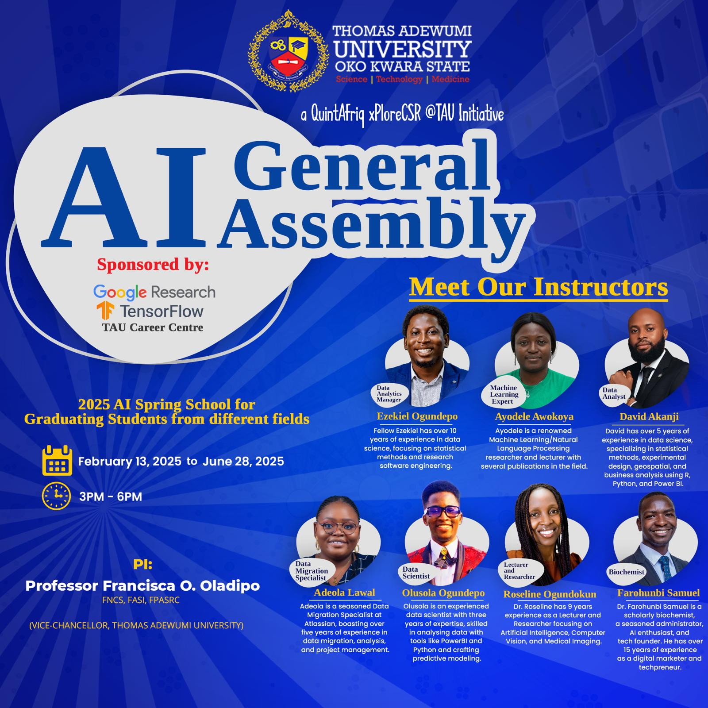

# AI General Assembly 2025 Resources

This repository contains all the materials you’ll need for the training, including resources on Excel, R, Python, Power BI, advanced AI tools (ChatGPT, NotebookLM, Gemini and Gamma), LinkedIn optimisation and digital marketing. Each resource is designed to prepare you for tomorrow’s dynamic job market. For guidance on how to navigate and use these materials, please watch the accompanying video available at [this link](https://www.youtube.com/watch?v=1Zegh5r9Kv8&list=PLjYLjYQsEVFHwwMoH-kY3rBqUAo4nmO_z&ab_channel=GBGAnalytics).
