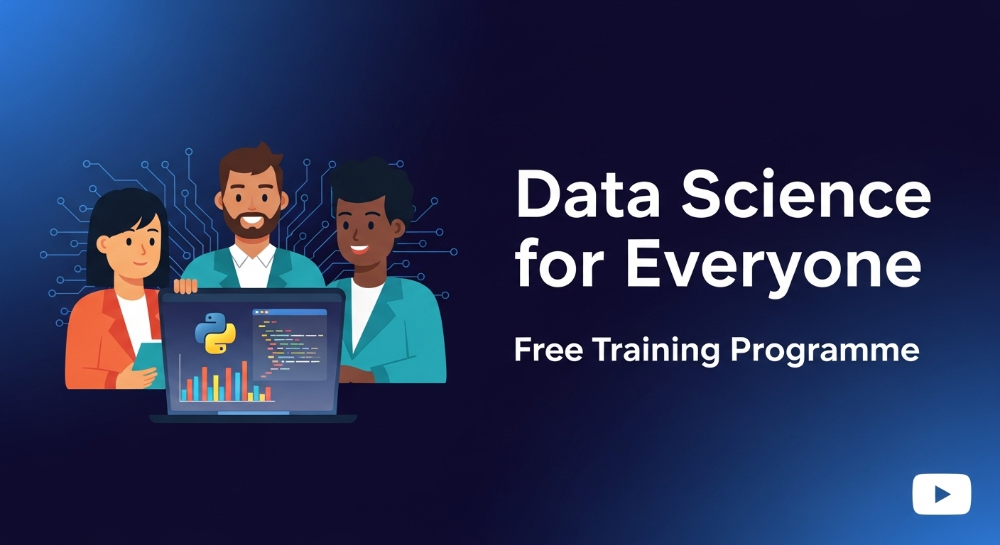

# Data Science for Everyone Training Programme

Welcome to our curated learning path that blends clear explanations with hands-on practice. Each playlist is carefully sequenced so that you can *watch, code, and apply* immediately, building confidence as you progress from the basics to advanced data-driven solutions.

---

## Who Should Enrol?

| Audience                            | Why This Programme Helps                                                            |
| ----------------------------------- | ----------------------------------------------------------------------------------- |
| **Aspiring data scientists**        | Start from zero and gain a solid foundation without prior experience.               |
| **Working professionals**           | Add in-demand data and AI skills to accelerate your career transition or promotion. |
| **Entrepreneurs & business owners** | Learn how to turn raw data into insights that sharpen strategy and boost growth.    |
| **Students & recent graduates**     | Complement academic theory with the practical skills employers expect.              |

---

## Programme Structure

The content is organised into three focused YouTube playlists. Work through them in order or dip into the one that meets your current need.

| Module| Title                                                              | What You’ll Learn                                                                                                          | Playlist                                                                                       | 
| ------- | ------------------------------------------------------------------- | -------------------------------------------------------------------------------------------------------------------------- | ---------------------------------------------------------------------------------------------- |
| 1  | **Programming with Python: A Beginner’s Guide**                  | Python syntax, data types, functions, and best practices, plus mini tasks after each video to lock in learning.            | [Watch the playlist](https://www.youtube.com/playlist?list=PLjYLjYQsEVFHwwMoH-kY3rBqUAo4nmO_z) | 
| 2  | **Python for Data Analysis: A Practical Guide**                  | Pandas, NumPy, data cleaning, exploratory analysis, and real-life case studies that show you *why* each technique matters. | [Watch the playlist](https://www.youtube.com/playlist?list=PLjYLjYQsEVFHwwMoH-kY3rBqUAo4nmO_z) | 
| 3  | **Data Science Essentials: From Statistics to Machine Learning** | Core statistical concepts, feature engineering, model training, and evaluation, finished off with examples of deployment.  | [Watch the playlist](https://www.youtube.com/playlist?list=PLjYLjYQsEVFHwwMoH-kY3rBqUAo4nmO_z) | 

> **Tip:** Schedule regular coding sessions after each video. Even 20 minutes of practice reinforces what you just learned.

---

## Downloadable Materials

You can download the code files and datasets for all three modules at once [here](https://bit.ly/ds4e-materials), or you can download them individually:

* **Module 1:** [Python Programming](https://bit.ly/ds4e-module1)

* **Module 2:** [Data Analysis with Python](https://bit.ly/ds4e-module2)

* **Module 3:** [Data Science Essentials](https://bit.ly/ds4e-module3)

---

## Learning Outcomes

By completing the three playlists you will be able to:

1. **Clean, analyse, and visualise data** with core Python libraries such as pandas, NumPy, Matplotlib, Seaborn, and Plotly, turning raw datasets into clear insights.
2. **Create reproducible reports and dashboards** in Jupyter Notebooks or Quarto (using Python code chunks) that weave narrative, code, and results into a single, shareable document.
3. **Build, evaluate, and deploy machine-learning models** using Python’s popular libraries (scikit-learn, XGBoost, and others).
4. **Integrate AI tools responsibly** to automate workflows, generate content, and solve real-world problems.

---

## How to Get the Most from This Programme

1. **Set up your environment:** Install Python and a code editor (VS Code or Anaconda).
2. **Code along:** Pause the video, type the examples, and tweak them to see what changes.
3. **Join the discussion:** Post questions or share your projects in the video comments and community forum.
4. **Build a portfolio:** Save your notebooks, scripts, and dashboards—future employers will want to see them.

Ready to begin? Click the first playlist and start your journey toward practical data science and AI mastery today.
