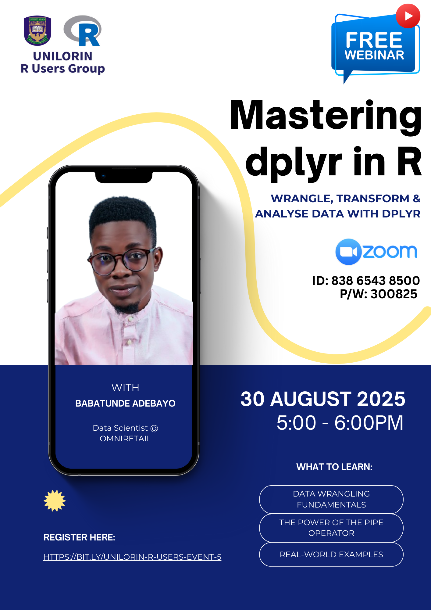

# Wrangle, Transform, Analyse: Your Path to Mastering dplyr in R

Welcome to the **UNILORIN R Users Group Meetup** event repository. Here you will find:

- [Presentation slides](https://gbganalyst.github.io/youtube/UNILORIN-R-Users-Group/Meetup-with-Babatunde/mastering-dplyr.html)  
- Example code snippets  
- Supplementary materials  

All resources were shared by our speaker, [Mr Babatunde](https://www.meetup.com/unilorin-r-users-group/events/310459403/). To learn how to navigate and apply these materials, please watch the tutorial video on YouTube:

**[Mastering dplyr in R](https://youtu.be/crK537Kyz_Y)**
