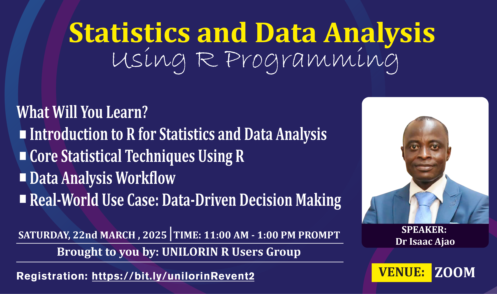

# Introduction to Statistics and Data Analysis Using R Programming

Welcome to the **UNILORIN R Users Group Meetup** event repository. Here you will find:

- Presentation slides  
- Example code snippets  
- Supplementary materials  

All resources were shared by our speaker, [Dr Isaac](https://www.meetup.com/unilorin-r-users-group/events/306314413/). To learn how to navigate and apply these materials, please watch the tutorial video on YouTube: <https://youtu.be/qQlf4ySLpjQ>

