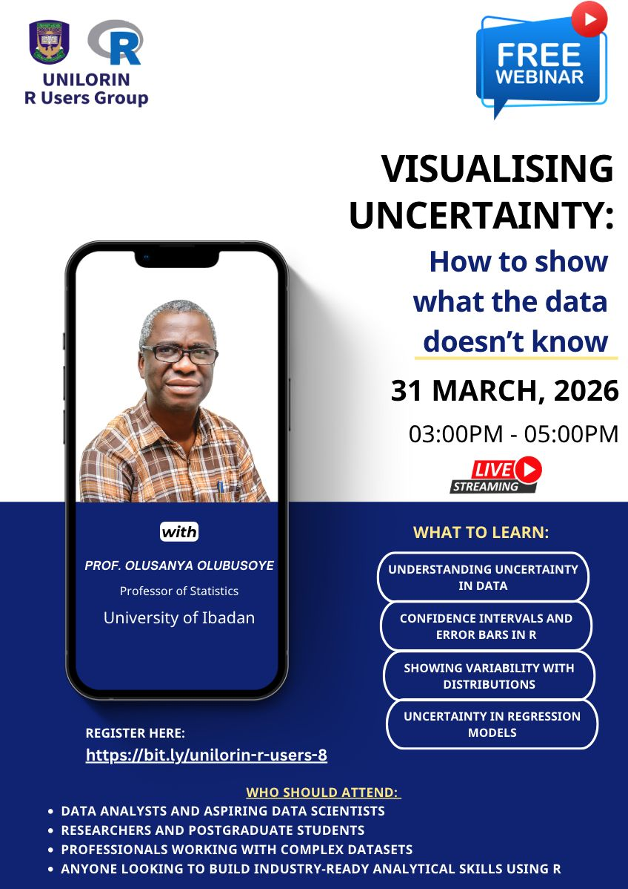

# Visualizing Uncertainty: How to Show What the Data Doesn’t Know

Welcome to the **UNILORIN R Users Group Meetup** event repository. Here you will find:

- Presentation slides  
- Example code snippets  
- Supplementary materials  

All resources were shared by our speaker, [Prof.Olubusoye](https://www.meetup.com/unilorin-r-users-group/events/313720019/). To learn how to navigate and apply these materials, please watch the tutorial video on YouTube:

**[Visualizing Uncertainty: How to Show What the Data Doesn’t Know](https://www.youtube.com/watch?v=G3Met0w8Ilo&t=87s)**
