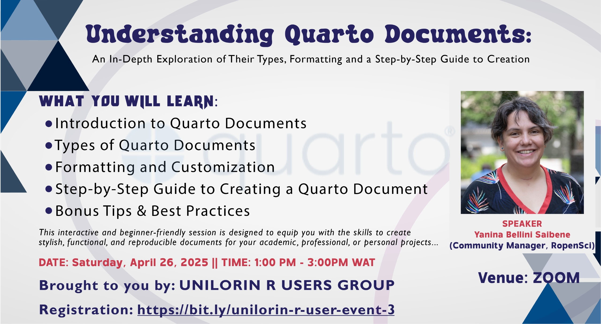

# Understanding Quarto Documents: Types, Formatting, and Creation

Welcome to the **UNILORIN R Users Group Meetup** event repository. Here you will find:

- Presentation slides  
- Example code snippets  
- Supplementary materials  

All resources were shared by our speaker, [Yani](https://www.meetup.com/unilorin-r-users-group/events/307158068/). To learn how to navigate and apply these materials, please watch the tutorial video on YouTube:

**[Introduction to Quarto Documents](https://www.youtube.com/watch?v=xuCF2bqaUfE)**
