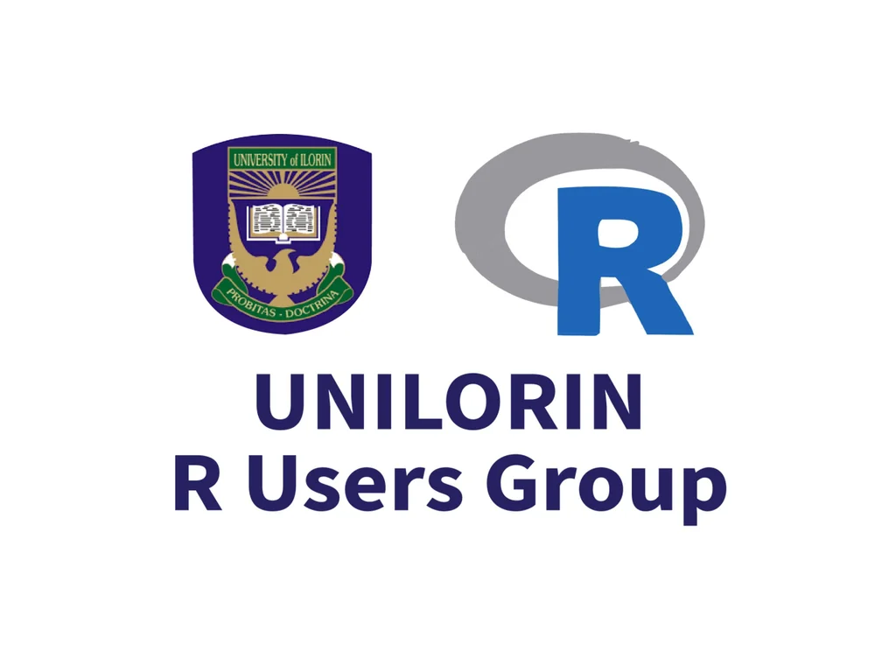

# UNILORIN R Users Group Meetup Series

Welcome to the **UNILORIN R Users Group** repository.

We explore functional programming, big data analytics, and data science using the **R programming language**. Our community brings together learners, professionals, and researchers who are passionate about R and its applications across business, healthcare, clinical research, and more.

## About the Community

The UNILORIN R Users Group is dedicated to:

* Promoting the use of R for data science and analytics
* Building a strong network of R enthusiasts and professionals
* Sharing knowledge through meetups, seminars, training, and conferences
* Supporting innovation in data science, artificial intelligence, and machine learning

Whether you're a beginner or an experienced practitioner, you are welcome to learn, share ideas, and grow with the community.

## Join the Group

Become a member of the UNILORIN R Users Group by visiting our Meetup page:

➡️ **[https://www.meetup.com/unilorin-r-users-group](https://www.meetup.com/unilorin-r-users-group)**

Membership is free and open to all.

## Stay Connected

Follow us for updates on events, workshops, and discussions:

* **YouTube:** [https://www.youtube.com/@gbganalytics](https://www.youtube.com/@gbganalytics)

We look forward to having you as part of our community.

